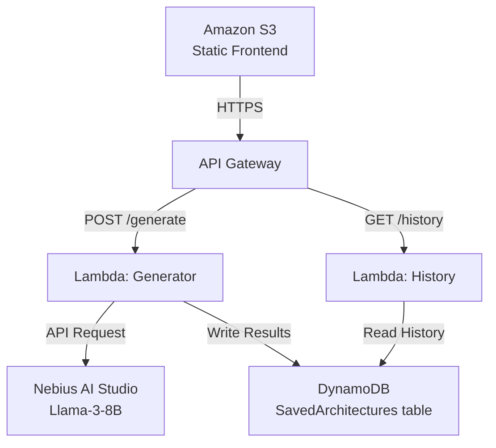

# Weekend Productivity Challenge: CloudBlueprint


## 1. Vision & What the App Does

Every software project starts with the exact same productivity bottleneck: *“What AWS services do I actually need, and how do they connect?”* Hackathons and weekend builds are often stalled in the first hour by this blank-page problem.

**CloudBlueprint** is an AI-powered visual productivity tool that eliminates this delay. By inputting a plain-English project idea (e.g., *“a campus food delivery app with authentication and order notifications”*), CloudBlueprint immediately returns:
1. **AWS Service Stack Recommendations:** Selects the precise serverless services required (such as S3, API Gateway, Lambda, DynamoDB, Cognito, and SNS).
2. **Interactive System Flow Canvas:** Renders a responsive AWS diagram using curved glowing neon paths and isolated VPC subnets (with dedicated DMZ public subnets and secure private compute subnets).
3. **Ordered Build Sequence Checklist:** A step-by-step progress tracking task board to guide developers chronologically through their hackathon configuration.
4. **Complexity & Estimated Cost Badges:** Visual indicators showing difficulty tiers and pricing constraints.

By instantly drafting a whiteboard architecture layout and configuration sequence, CloudBlueprint saves builders hours of initial architectural debate.

---

## 2. How I Built It

The app is built as a complete serverless solution using a decoupled architecture.

### Decoupled State & Layout
* **The Frontend:** Built using responsive HTML5, CSS3, and Vanilla JavaScript. I designed an Obsidian Dark Mode theme with Glassmorphism cards. The visual diagram renderer automatically maps card positions using client-side viewport coordinates, drawing curved SVG paths to act as connection lines.
* **The Backend:** Constructed using Python 3.12 Lambdas exposed via an API Gateway. It writes all results to a DynamoDB table with generated UUID keys.

### Challenge & Overcoming Latency
* **Model Selection:** Initially, I structured the backend to invoke Amazon Bedrock Nova Micro. Due to model access request requirements on new AWS accounts, I hit a `ValidationException` block. To bypass this, I refactored the Lambda function to invoke models on the **Nebius AI Studio Tokenfactory** endpoint.
* **Tuning API Speed:** Querying `meta-llama/Llama-3.3-70B-Instruct` yielded detailed plans, but the 20-second inference latency frequently hit the API Gateway's 29-second timeout limit. I resolved this by swapping to the smaller **`meta-llama/Meta-Llama-3-8B-Instruct`** model. This dropped backend response times to **under 2 seconds**, offering a snappy, instant-render user experience.
* **User Engagement Loading Indicators:** To prevent users from feeling stuck, I added a dynamic loader that cycles through logical planning steps ("Analyzing requirements...", "Mapping subnets...") during the API wait time.

---

## 3. AWS Services Used & Architecture Overview

```text
                     +---------------------+
                     |      Amazon S3      |
                     |  (Static Frontend)  |
                     +----------+----------+
                                | HTTPS
                                v
                     +---------------------+
                     |    API Gateway      |
                     |   POST /generate    |
                     |   GET  /history     |
                     +----------+----------+
                                |
                  +-------------+-------------+
                  |                           |
                  v                           v
      +-----------------------+   +-----------------------+
      |   Lambda: Generator   |   |    Lambda: History    |
      | - Calls Nebius AI     |   | - Reads DynamoDB      |
      | - Parses JSON output  |   | - Returns saved list  |
      | - Writes to DynamoDB  |   |                       |
      +-----------+-----------+   +-----------+-----------+
                  |                           |
                  v                           v
      +-----------------------+   +-----------------------+
      |   Nebius AI Studio    |   |       DynamoDB        |
      |    (Llama-3-8B)       |   |  SavedArchitectures   |
      |                       |   |         table         |
      +-----------------------+   +-----------------------+
```

Alternatively, here is the diagram in **Mermaid** format (if the blog publisher supports it):



* **Amazon S3 Website Hosting:** Hosts the client-side Single Page Application.
* **Amazon API Gateway:** Exposes secure REST endpoints routing user requests to compute functions.
* **AWS Lambda (Python 3.12):** Executes the backend logic, handles API headers, calls Llama 3 8B, and stores/fetches database items.
* **Amazon DynamoDB:** Stores the history of generated plans in a single-key table.

---

## 4. What I Learned

This challenge reinforced the power of serverless building. Key takeaways:
* **JSON Formatting Constraints:** How to use system prompts and temperature adjustments to force LLMs to output clean, un-escaped JSON layouts.
* **SVG coordinate mapping:** Using absolute offsets dynamically to create responsive canvas connections.
* **API Gateway Limitations:** Developing for the 29-second API Gateway execution timeout, ensuring model sizes are balanced for low latency.

---

## 5. Screen Walkthrough & Diagrams

### 🖼️ Interactive Architecture Generator View
This view demonstrates the layout rendering, dynamic subnet boxes, and interactive checklist tracker:
- [View Generator Screenshot](file:///c:/Users/joshi/Desktop/AWSome%20Challenge/cloudblueprint/walkthrough_generator.png)

### 🖼️ Saved Blueprints Library
Past configurations are persisted inside DynamoDB and can be re-loaded:
- [View History Screenshot](file:///c:/Users/joshi/Desktop/AWSome%20Challenge/cloudblueprint/walkthrough_history.png)

---

## 6. Project Resource Links

* **GitHub Repository:** [https://github.com/pwnjoshi/AI-powered-visual-productivity-tool-for-AWS-Student-Builders](https://github.com/pwnjoshi/AI-powered-visual-productivity-tool-for-AWS-Student-Builders)
* **Live Deployed S3 URL:** [http://cloudblueprint-frontend-013131247228.s3-website-us-east-1.amazonaws.com](http://cloudblueprint-frontend-013131247228.s3-website-us-east-1.amazonaws.com)

---

**Submission Tags:** #productivity #aws-student-builders #serverless #ai-productivity-tool
